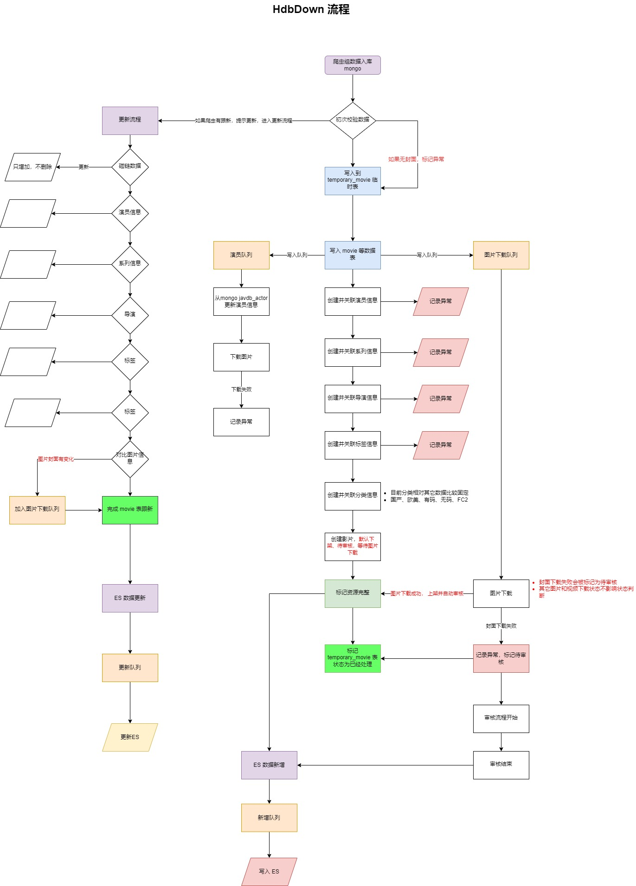

# 黄豆瓣爬虫

## 项目结构


> ES 队列的相关部分暂时未引入，后期可能会将 es_code 整个项目合并到本项目中

## windows 交叉编译
```shell script
set GOARCH=amd64
set GOOS=linux
go build
```


## 框架包含的扩展

- gorm.io/driver/mysql
- go-redis/redis/v8
- go.mongodb.org/mongo-driver


## 线上更新流程
1. 安装 golang 环境 
2. git pull 代码
3. cp .env.example .env 并配置
    1. mysql 密码必须使用单引号
    2. mysql 端口配置到 HOST 中,格式为 "127.0.0.1:3306" 
    3. 根据实际线上情况配置图片下载路径
    4. downdomain 为第三方爬虫图片资源库
    5. mongo 相关为三方怕从资源，非本公司所有
4. cd hdbdown_code && go mod tidy -go=1.17
5. cd hdbdown_code && go build
6. cp hdbdown ../hdbdown 根目录
7. chmod +x hdbdown 
8. 手动执行一次 .hdbdown 
9. 检查是否正常执行
10. supervisorctl start HdbDown